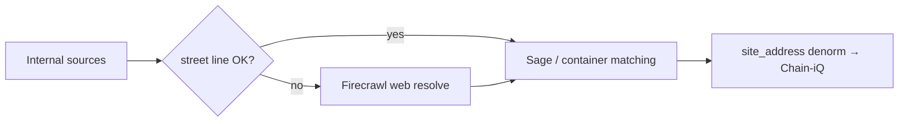

# Firecrawl web resolve for site addresses

When `property_registry.address_line1` is missing, `TBD`, or a non-street placeholder (Core Spaces LLC, ATTN lines), **web search is the fallback** before Sage ship-to matching and Chain-iQ `site_address` sync.

## Pipeline position



| Step | Script | Flag |
|------|--------|------|
| Standalone batch | `resolve-site-address-firecrawl.mjs` | `--apply --limit=N` |
| Before Sage match | `sync-sage-shipto-project-property.mjs` | `--resolve-web` |
| Before Chain sync | `sync-site-address-to-chain.mjs` | `--resolve-web-first` |
| Comprehensive backfill | `run-comprehensive-sage-shipto-backfill.sh` | Phase 2b + Phase 3 |

Shared module: `scripts/lib/site-address-resolve.mjs` (also used by `sage-shipto-match` address keys after fill).

## What Firecrawl does

1. Build 3–4 queries from property name, city/state, project name, developer, Hub-on-Campus patterns.
2. `POST /v1/search` with `scrapeOptions.markdown` (property sites, press releases, architect pages).
3. Extract install address — **Claude primary** when `ANTHROPIC_API_KEY` is set; regex only with `--no-llm`.
4. Score candidates: city/state must match Registry hints; reject obvious noise.
5. Write only when confidence ≥ 0.65 (default apply threshold 0.72 in batch).
6. Append provenance to `property_registry.enrichment_sources` (`type: site_address_firecrawl`).

## Env

From `Derived State/dale-chat/.env.local`:

- `FIRECRAWL_API_KEY` (required)
- `ANTHROPIC_API_KEY` (**recommended** — primary extractor; regex-only is fallback via `--no-llm`)
- `REGISTRY_IQ_SUPABASE_*`

CLI `firecrawl login` is optional; scripts use the API key directly (same as `rita-enrich-batch.mjs`).

## Commands

```bash
cd "/Users/geoffreyjackson/Dropbox/The Living Company/TLC iQ/Property_Registry"

# Preview one city
node scripts/resolve-site-address-firecrawl.mjs --dry-run --city=Bloomington --limit=5

# Apply batch (rate-limited ~400ms between queries)
node scripts/resolve-site-address-firecrawl.mjs --apply --limit=25

# Sage matching with web pre-pass
node scripts/sync-sage-shipto-project-property.mjs --apply --resolve-web --resolve-web-limit=40

# Chain site_address after web fill
node scripts/sync-site-address-to-chain.mjs --apply --resolve-web-first --resolve-web-limit=30
```

## Doctrine

- **No fabrication** — only addresses found in scraped content (LLM instructed accordingly).
- **Registry wins** — never overwrite a good existing `address_line1`.
- **Sage / NetSuite are not replaced** — web resolve fills Registry; Sage matching still uses `lib/sage-shipto-match.mjs` tiers on the enriched row.
- **Human review** — low-confidence or conflicting addresses stay skipped; use `/registry-review` or manual edit.
- **Cost control** — always use `--limit`; ~1,200 properties currently lack a real street line.

## Known pitfalls

- Official sites may list **leasing office** or **sibling property** addresses (e.g. Hub contact pages). Scoring prefers city/state match; LLM prompt asks for install site vs HQ.
- Regex alone can miss formatted addresses; enable LLM for production batches.
- Re-run `sync-site-address-to-chain.mjs --apply` after web resolve to push new streets to containers.

## Related

- `docs/SITE_ADDRESS_WIRING.md` — Chain-iQ `site_address` column
- `docs/SAGE_SHIPTO_PROJECT_PROPERTY_LINK.md` — ship-to matching tiers
